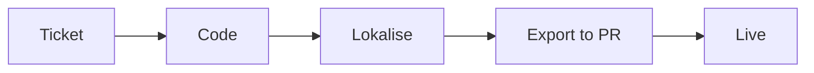

# Translation Sync Workflow (Lokalise ↔ GitHub)

How English source and translated strings move between the codebase and Lokalise. Companion to [TranslationBestPractices.md](./TranslationBestPractices.md) (token naming/authoring) and the [Lokalise Translator Guide](./LokaliseTranslatorGuide.md) (for the Lokalise side).

## Overview

- English is the **source of truth for new keys**, in `src/locales/en/translation.json` - developers add them in code and the push sends them up to Lokalise.
- **Lokalise is the source of truth for existing keys' English** - the pull overwrites `en/translation.json` with Lokalise's export, so English normalization done there flows back into the code.
- Target-language values are authored and **reviewed in Lokalise**, then pulled back.
- Two token-based GitHub Actions do the sync, using the `LOKALISE_API_TOKEN` and `LOKALISE_PROJECT_ID` secrets:
  - **Push** (`.github/workflows/lokalise-push.yml`) - uploads English source to Lokalise, automatically on merge to `develop` (plus a manual option).
  - **Pull** (`.github/workflows/lokalise-pull.yml`) - downloads translations as a PR, automatically every week (plus a manual option).

Both directions run automatically - the **push** fires whenever English source lands on `develop`, and the **pull** runs on a **weekly** schedule. **The automation doesn't replace manual control: either workflow can also be run on demand at any time** (see [Triggering manually](#triggering-manually)) - handy for backfilling source or pulling time-sensitive translations without waiting for the schedule.

## Workflow steps



1. **Ticket** - On a requested feature, any verbiage for the website is turned into key:value pairs. The developer adds the tokens to `src/locales/en/translation.json` (see [naming conventions](./TranslationBestPractices.md)).
2. **Code** - The code is merged upon approval to `develop`. The push workflow then **automatically uploads the English source to Lokalise** whenever `src/locales/en` changes on `develop`. (It can also be run manually via workflow dispatch, e.g. to backfill.)
3. **Lokalise** - Automations run for the translation tokens:
   - Google Translate / DeepL provide machine translations for the new values.
   - Statuses on changed tokens are cleared, and new tokens are set to **unverified**.
   - A translator reviews each value and marks it **Reviewed**. Marking Reviewed is what controls release once the reviewed-only filter is enabled - though that filter is **currently disabled** (see [Reviewed-only filter](#reviewed-only-filter-currently-disabled) below), so for now all translations pull back regardless of status.
4. **Export to PR** - Translations are pulled **weekly (Mondays 09:00 UTC)**, or **on demand** via manual trigger, into a PR against `develop` (branch `chore/lokalise-translations`). Code reviewers can update text where needed before merging.
5. **Live** - Merged verbiage reaches the production environment through the normal release process.

## Push: code → Lokalise

- Uploads the **English base language only** (translations live in Lokalise).
- Runs **automatically on merge to `develop`** when `src/locales/en/**` changes, plus **on demand** (`workflow_dispatch`).
- `convert_placeholders: false` keeps i18next `{{interpolation}}` and custom tags (`<helperTextLink>`, `$t(...)`) intact.
- `use_tag_tracking: true` (creates a `lokalise-upload-complete` git tag) so multi-commit pushes detect every changed file.
- **Never deletes keys** - it only adds/updates. Removing stale keys is done manually in Lokalise.

## Pull: Lokalise → code

- Opens a PR against `develop` (branch `chore/lokalise-translations`, labels `i18n,automated`).
- Runs **weekly (Mondays 09:00 UTC)** and **on demand** (`workflow_dispatch`). The PR body says "Automated weekly pull" vs "Manual pull" depending on the trigger.
- **Force-pushes a single fresh commit each run** (`force_push: true`) rather than appending. The branch (and its existing PR, same number/thread) is rewritten to one commit representing the full diff between `develop` and Lokalise's current export. This works because **nobody edits this branch** - all corrections go back through Lokalise - so there is no branch-local work to preserve, and the PR always mirrors Lokalise's current state instead of accumulating weeks of stacked "pull latest" commits. See [Critical configuration](#critical-configuration-and-why).
- **Overwrites** the locale files with what Lokalise exports (it does not merge). The app falls back to English for anything missing.
- **Includes English** via `always_pull_base: true` - without it the action drops base-language changes and `en/translation.json` never updates (see [Critical configuration](#critical-configuration-and-why)).
- Pulls **all enabled languages** (currently `en`, `id`, `es`, `fr`, `pt`, `tl`).

### Reviewed-only filter (currently disabled)

The intended design is to export **reviewed-only** strings (`filter_data: ["reviewed_only"]`), so only translations a human has marked **Reviewed** reach the code. Because the pull overwrites, that also means any string *not* marked Reviewed would be dropped from the repo (the app then shows English).

**The filter is currently disabled** - the `filter_data` option has been removed from the pull config, so the pull brings back **all** translations regardless of review status. This is deliberate: while the languages are still being reviewed, turning the filter on would strip the app of every not-yet-reviewed string. The filter will be **re-enabled once all relevant languages are fully reviewed**, by re-adding `"filter_data": ["reviewed_only"]` to the pull's `additional_params` - at which point nothing is dropped because everything is reviewed.

## Critical configuration (and why)

- **Key filenames must be `src/locales/%LANG_ISO%/translation.json`.** This is what maps Lokalise files to the repo. Bare filenames (e.g. `translation.json`) silently break the pull with "No changes detected". Set in Lokalise via bulk **File: assign**.
- **`always_pull_base: true`** (pull config) - the pull action **defaults this to `false`**, which silently drops base-language (English) changes: target languages sync but `en/translation.json` is never updated. It **must** be set to `true` for Lokalise's English source-of-truth edits on existing keys to flow back (see [Pull](#pull-lokalise--code)).
- **`force_push: true`** (pull config) - each run replaces the `chore/lokalise-translations` branch with one fresh commit instead of appending. Safe because the branch is never hand-edited (corrections are made in Lokalise), and it keeps the PR a clean, always-current mirror of Lokalise rather than a growing stack of weekly commits (see [Pull](#pull-lokalise--code)).
- **`plural_format: i18next_v4`** - matches the code's `_one` / `_other` plural keys (i18next v4). The older `i18next` (v3, `_plural`) would break pluralization.
- **`json_unescaped_slashes: true`** - exports `/` instead of `\/`, matching the repo and prettier (avoids diff noise).
- **`filter_data: ["reviewed_only"]`** - the reviewed-only filter, **currently disabled/removed** (see [Reviewed-only filter](#reviewed-only-filter-currently-disabled)). `export_empty_as: skip`, `export_sort: a_z`, 2-space indent.
- **`fallbackLng: 'en'`** (in `i18n.ts`) - any missing translation renders English, so the UI degrades to English rather than breaking.

## Triggering manually

Both workflows keep their automatic triggers **and** stay available to run by hand whenever you need to - the automation is in addition to, not instead of, manual runs. Actions → select the workflow → **Run workflow** (branch `develop`), or:

```bash
gh workflow run lokalise-pull.yml --ref develop
gh workflow run lokalise-push.yml --ref develop
```

## Troubleshooting

- **Pull reports "No changes detected" but you expect changes** - almost always a filename mismatch: keys must carry the `src/locales/%LANG_ISO%/` prefix. Also remember only **Reviewed** strings are pulled.
- **Pull PR deletes many translations** - this happens when the reviewed-only filter is on but those strings aren't marked Reviewed (overwrite + reviewed-only). The filter is currently disabled to avoid exactly this; before re-enabling it, mark all needed strings Reviewed first.
- **Escaped-slash or plural churn in a PR** - check `json_unescaped_slashes` and `plural_format` in the pull config.
- **A just-reviewed string isn't in the pull** - Lokalise export can lag a few minutes after the Reviewed flag is set; re-run the pull.
- **English edits made in Lokalise don't reach the repo (but target languages do)** - the pull's `always_pull_base` is `false` (its default). It must be `true`, or the action silently drops all base-language changes.

## Languages and rollout phases

The translation process was introduced in phases:

1. **Tokenization** - developers tokenize the UI codebase. During this phase, only **text normalization** (capitalization, etc.) of English is accepted in Lokalise, to prevent merge conflicts. Machine translations are reviewed to confirm the accuracy of the translation engine in use.
2. **Fully tokenized UI** - verbiage updates that have been discussed/vetted by the team (through tickets or other means) can be proposed through Lokalise. Time-sensitive updates go out with an **on-demand pull run** (this replaces the retired integration's "build button").

Current language focus is **Bahasa Indonesia (`id`)**, with Portuguese planned. Spanish, French, and Tagalog translations also exist in Lokalise and flow back once reviewed. On non-production environments, a language picker in the header (`LanguageMenuTool` in `src/components/Header/Header.jsx`) lets QA preview English vs Bahasa Indonesia in context.

## Adding a language

Enable it in Lokalise and ensure its keys carry the `src/locales/%LANG_ISO%/translation.json` filename. The pull will then write reviewed strings to `src/locales/<lang>/translation.json`. Wire the language into the app's i18n config / language picker as needed.

## History

The previous native Lokalise↔GitHub OAuth integration (which created manual "push to GitHub" PRs named `lokalise-<timestamp>`, triggered by the Download page's build button) was retired in favour of the two token-based Actions above.
